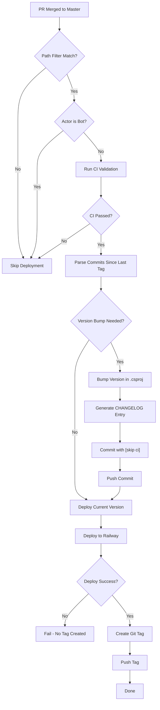

# Design: Continuous Deployment with Semantic Versioning

## Context
We need to add Continuous Deployment (CD) to Railway for all services in the monorepo, with automatic semantic versioning and changelog generation. The solution must scale easily as new services are added, requiring minimal configuration per service. The project already uses Conventional Commits (`feat:`, `fix:`, `chore:`, `docs:`) and has a CI pipeline with reusable workflows.

## CD Workflow Overview



## Constraints
- **Monorepo**: Multiple independent services that should be versioned and deployed separately
- **Semantic Commits**: Project already uses Conventional Commits format
- **Railway**: Each service deploys to its own Railway project
- **Scalability**: Adding a new service to CD must require minimal effort (copy-paste pattern)
- **Version Storage**: .NET projects store versions in `.csproj` files or `Directory.Build.props`
- **Git Tags**: Need to track releases per service for rollback capabilities
- **Isolation**: Changes to one service must NOT trigger deployment of other services
- **Path Filtering**: Each service workflow must only trigger when its specific paths change

## Goals / Non-Goals

### Goals
- Automate deployment to Railway after successful CI validation
- Automatically increment versions based on semantic commit types
- Generate CHANGELOG.md from commit messages per service
- Create git tags for each deployed version
- Support per-service versioning and deployment
- Make it easy to add new services to CD (minimal configuration)

### Non-Goals
- Manual version management or changelog writing
- Single version for entire monorepo (each service has its own version)
- Complex release workflows (keep it simple: merge → version → deploy → tag)

## Decisions

### Decision 1: Version Storage Location
**Decision**: Store version in each service's `.csproj` file using `<Version>` property.

**Rationale**:
- .NET standard approach
- Version is visible and accessible via `dotnet build`
- Each service can have independent versioning
- Easy to read/update programmatically

**Alternative Considered**: Centralized version in `Directory.Build.props`
- **Rejected**: Would force all services to share the same version, which doesn't fit our per-service deployment model

### Decision 2: Semantic Versioning Tool
**Decision**: Use a custom script/action that parses git commits and updates `.csproj` files.

**Rationale**:
- Full control over versioning logic
- No external dependencies (GitVersion, semantic-release require Node.js or additional setup)
- Can be implemented as a GitHub Actions step using bash/PowerShell
- Matches our "boring technology" principle

**Alternatives Considered**:
- **GitVersion**: Powerful but adds complexity and requires configuration files
- **semantic-release**: Node.js based, requires npm setup
- **Custom script**: Simple, maintainable, fits our needs

### Decision 3: Version Bump Logic
**Decision**: Use Conventional Commits specification:
- `feat:` → minor version bump (1.2.3 → 1.3.0)
- `fix:` → patch version bump (1.2.3 → 1.2.4)
- `BREAKING CHANGE:` footer or `!` in type → major version bump (1.2.3 → 2.0.0)
- `chore:`, `docs:`, `refactor:` → no version bump (unless combined with other types)

**Rationale**:
- Aligns with Semantic Versioning (semver.org)
- Matches industry standards
- Simple to implement and understand

### Decision 4: Changelog Generation
**Decision**: Generate CHANGELOG.md using a custom script that:
- Parses commits since last git tag
- Groups by commit type (`feat:`, `fix:`, `chore:`, etc.)
- Formats as markdown with sections: Added, Fixed, Changed, Other
- Prepends to existing CHANGELOG.md (newest first)

**Rationale**:
- Standard format (Keep a Changelog style)
- Per-service changelogs (one per service directory)
- Only includes commits affecting that service's paths

**Alternative Considered**: Use `git-cliff` or similar tools
- **Rejected**: Adds external dependency; custom script gives full control

### Decision 9: Railway Configuration File Format
**Decision**: Use `railway.json` with JSON schema reference for each service.

**Rationale**:
- JSON schema provides editor autocomplete and validation (`$schema: "https://railway.com/railway.schema.json"`)
- Common format in .NET projects
- Both `railway.json` and `railway.toml` are equivalent; JSON chosen for consistency
- Lightweight per-service configuration

**Configuration Structure**:
- Each service has its own `railway.json` in service directory (`src/backend/<service-name>/railway.json`)
- Minimal configuration: specify `startCommand` and optionally `healthcheckPath` if health endpoint exists
- Use Railway's auto-detection for build commands (Railpack handles .NET automatically)
- For .NET: `startCommand` should use `$PORT` environment variable: `dotnet <app>.dll --urls http://*:$PORT`

**Example `railway.json` for .NET service**:
```json
{
  "$schema": "https://railway.com/railway.schema.json",
  "deploy": {
    "startCommand": "dotnet NotificationService.dll --urls http://*:$PORT",
    "healthcheckPath": "/health",
    "healthcheckTimeout": 30
  }
}
```

**Notes**:
- JSON schema provides editor autocomplete and validation
- `buildCommand` is omitted (Railpack auto-detects `dotnet build`)
- `startCommand` uses shell variable substitution (`$PORT`)
- Health check is optional but recommended for production services

**Alternative Considered**: `railway.toml`
- **Rejected**: Less common in .NET ecosystem, no schema support

### Decision 10: Railway Build Configuration
**Decision**: Use Railway's Railpack builder with auto-detection, minimal explicit configuration.

**Rationale**:
- Railpack is Railway's modern builder (Nixpacks is deprecated)
- Auto-detects .NET projects and build commands (`dotnet build`)
- Zero configuration needed for standard .NET projects
- Only override `startCommand` to ensure PORT binding

**Railway-Specific Requirements**:
- Application MUST listen on `$PORT` environment variable
- Application MUST bind to `0.0.0.0` (not `localhost` or `127.0.0.1`)
- For .NET: Use `--urls http://*:$PORT` in start command
- No Dockerfile needed unless custom build steps required

**Alternative Considered**: Dockerfile-based builds
- **Rejected**: Adds complexity; Railpack auto-detection is sufficient for standard .NET apps

### Decision 5: Git Tag Format
**Decision**: Use format `<service-name>/v<version>` (e.g., `notification-service/v1.3.0`)

**Rationale**:
- Clearly identifies which service the tag belongs to
- Supports multiple services in monorepo
- Easy to filter tags per service: `git tag -l 'notification-service/*'`
- Standard `v` prefix for version tags

**Alternative Considered**: `v<version>-<service-name>` (e.g., `v1.3.0-notification-service`)
- **Rejected**: Less intuitive, harder to group by service

### Decision 6: Deployment Workflow Integration
**Decision**: Extend the existing reusable workflow (`template-dotnet-ci.yml`) to include:
1. Version bump job (runs before deployment)
2. Changelog generation job (runs after version bump)
3. Deployment job (runs after version/changelog commits)
4. Git tag creation (runs after successful deployment)

**Rationale**:
- Reuses existing CI infrastructure
- Maintains single source of truth for workflow logic
- Service-specific workflows remain simple (just call template with parameters)

**GitHub Actions Best Practices**:
- Reusable workflow uses `on.workflow_call` trigger (cannot use path filters)
- Caller workflows (service-specific) handle path filtering via `on.push.paths` and `on.pull_request.paths`
- Use `workflow_call.inputs` to pass service-specific parameters (service_name, project_path, railway_service_id)
- Use `workflow_call.secrets` to pass Railway token securely
- Reference reusable workflow using relative path: `./.github/workflows/template-dotnet-ci.yml`
- Reference: [GitHub Docs: Reusing workflows](https://docs.github.com/en/actions/using-workflows/reusing-workflows)

**Example Caller Workflow Structure** (`notification-service-ci.yml`):
```yaml
name: Notification Service CI
on:
  pull_request:
    branches: [ master ]
    paths:
      - 'src/backend/notification-service/**'
      - '.github/workflows/notification-service-ci.yml'
  push:
    branches: [ master ]
    paths:
      - 'src/backend/notification-service/**'
      - '.github/workflows/notification-service-ci.yml'

jobs:
  changes:
    runs-on: ubuntu-latest
    outputs:
      service: ${{ steps.filter.outputs.service }}
    steps:
    - uses: dorny/paths-filter@v2
      id: filter
      with:
        filters: |
          service:
            - 'src/backend/notification-service/**'

  quality-gate:
    needs: changes
    uses: ./.github/workflows/template-dotnet-ci.yml
    with:
      service_name: 'NotificationService'
      project_path: 'src/backend/notification-service'
      coverage_threshold: 80
      railway_service_id: ${{ secrets.RAILWAY_SERVICE_ID }}
      bypass_checks: ${{ needs.changes.outputs.service != 'true' }}
    secrets:
      RAILWAY_TOKEN: ${{ secrets.RAILWAY_TOKEN }}
    permissions:
      contents: write  # Required for version/changelog commits and git tags
```

**Path Filtering Implementation** (GitHub Actions Best Practices):
- Path filtering MUST be done in caller workflows (service-specific workflows), NOT in reusable workflow
- Reusable workflows (`workflow_call`) do NOT support `on.push.paths` or `on.pull_request.paths` filters
- Each service workflow (e.g., `notification-service-ci.yml`) uses `on.push.paths` and `on.pull_request.paths` filters
- Workflow triggers only when changes affect `src/backend/<service-name>/**`
- Path filtering happens at caller workflow level, ensuring only affected services run
- Example: If PR changes only `src/backend/service-a/**`, only `service-a-ci.yml` workflow runs
- Reference: [GitHub Docs: Reusable workflows don't support path filters](https://docs.github.com/en/actions/using-workflows/reusing-workflows)

### Decision 7: Railway Deployment Method
**Decision**: Use Railway CLI (`railway up --service=<service_id>`) for deployment.

**Rationale**:
- Official Railway deployment method
- Works with Railway projects configured via `railway.json` or `railway.toml`
- Can be integrated into GitHub Actions easily
- Supports environment-specific deployments
- Per-service deployment control via `--service` flag

**Railway-Specific Implementation Details**:
- Use Railway project token (`RAILWAY_TOKEN`) stored as GitHub secret (not account token)
- CLI can be installed via npm (`@railway/cli`) or Docker image (`ghcr.io/railwayapp/cli:latest`)
- For monorepo, each service must specify `--service=<service_id>` flag
- Use `--detach --json` flags to trigger deployment and capture deployment ID
- **Wait-and-Verify via GraphQL API**: Poll Railway's GraphQL API for deployment status
  - Endpoint: `https://backboard.railway.com/graphql/v2`
  - Authentication: `Project-Access-Token: $RAILWAY_TOKEN` header
    - **Note**: This differs from the `Authorization: Bearer <token>` header used for Personal/Team tokens. Project Tokens (scoped to a project) MUST use `Project-Access-Token`.
  - Query deployment status using deployment ID from `railway up --json` output
  - Poll every 5 seconds, timeout after 5 minutes (60 attempts)
  - Success states: `SUCCESS`, `ACTIVE` (Railway only sets these after health checks pass)
  - Failure states: `FAILED`, `CRASHED`, `REMOVED`
  - In-progress states: `BUILDING`, `DEPLOYING`, `INITIALIZING`
- Only create git tag if deployment reaches `SUCCESS` or `ACTIVE` status
- Fallback: If deployment ID extraction fails, query latest deployment for the service

**Why GraphQL API over Log Parsing**:
- **Reliable**: Uses official Railway API, not fragile log pattern matching
- **Accurate**: Checks actual deployment status, not log output
- **Health-aware**: Railway only marks as SUCCESS after configured health checks pass
- **Industry standard**: Polling deployment status via API is the standard pattern
- **Maintainable**: Won't break if log formats change
- **Future-proof**: Railway's GraphQL API is a stable, versioned interface

**GitHub Actions Integration**:
- Store `RAILWAY_TOKEN` as repository secret (Settings → Secrets and variables → Actions)
- Reference secret using `${{ secrets.RAILWAY_TOKEN }}` syntax
- Never hardcode tokens in workflow files
- Use Docker container approach (`ghcr.io/railwayapp/cli:latest`) for consistent CLI version
- Reference: [GitHub Docs: Using secrets in GitHub Actions](https://docs.github.com/en/actions/security-guides/encrypted-secrets)

**Dockerfile Template Technical Details** (`.github/templates/dotnet-service.Dockerfile`):
- Multi-stage build: SDK image for build, ASP.NET runtime image for deployment
- Uses `mcr.microsoft.com/dotnet/aspnet:10.0` runtime image for minimal size
- CI workflow provisions Dockerfile from template if service doesn't have one
- Placeholders (`ExecutePlaceholder.dll`, `${PROJECT_PATH}`) replaced during CI provisioning

**Zero-Config Port Binding Strategy**:
- .NET 8/9/10 defaults to port 8080.
- Railway also defaults to port 8080 for health checks.
- By **omitting** the explicit `--urls` flag in `railway.json` and the `Dockerfile`, the framework and platform automatically negotiate the correct port.
- This avoids shell expansion issues (literal `$PORT` strings) and manual configuration overhead.

**Legacy Knowledge: CMD Shell Form for Variable Expansion**:
- If environment variables MUST be expanded in a Docker command, use **shell form** (`CMD command $VAR`) or a wrapper script. 
- **Exec form** (JSON array `CMD ["cmd", "$VAR"]`) does NOT expand variables and passes them as literal strings.
- This was initially the root cause of health check failures when using `--urls http://*:$PORT`.

**Alternative Considered**: Railway GitHub integration (automatic deploys)
- **Rejected**: Less control over deployment timing and version tracking

### Decision 11: Secrets Management Strategy
**Decision**: Use a two-tier secrets management approach: application secrets in Railway Variables, CI/CD secrets in GitHub repository secrets.

**Rationale**:
- Clear separation of concerns: application runtime secrets vs deployment infrastructure secrets
- Railway Variables are accessible to deployed services at runtime
- GitHub secrets are only accessible during CI/CD workflows
- Follows principle of least privilege: each secret type stored where it's needed

**Application Secrets (Runtime)**:
- **Storage**: Railway Variables per service (Railway dashboard → Service → Variables)
- **Examples**: `Telegram__BotToken`, `Telegram__ChatId`, database connection strings, API keys
- **Access**: Available to application at runtime via environment variables
- **Format**: Use double underscore (`__`) for nested configuration (e.g., `Telegram__BotToken` maps to `Telegram:BotToken` in .NET)
- **Local Development**: Use `appsettings.Development.json` (excluded from git via `.gitignore`)
- **Production**: Set in Railway Variables (never commit to repository)

**CI/CD Secrets (Deployment)**:
- **Storage**: GitHub repository secrets (Settings → Secrets and variables → Actions)
- **Examples**: `RAILWAY_TOKEN` (for Railway CLI), `RAILWAY_SERVICE_ID` (service identifier)
- **Access**: Only accessible during GitHub Actions workflow execution
- **Usage**: Passed to reusable workflows via `workflow_call.secrets`
- **Never**: Hardcode in workflow files or commit to repository

**Secrets Management Best Practices**:
- **Never commit secrets**: All secrets excluded from version control
- **Use sealed variables**: For ultra-sensitive secrets in Railway, use "sealed" variables
- **Service-scoped**: Each service has its own Railway Variables (no cross-service access)
- **Rotation**: Rotate secrets regularly, especially if exposed or compromised
- **Audit**: Monitor secret access and usage (Railway provides audit logs)
- **Local development**: Use `appsettings.Development.json` with dummy values, never production secrets

**Example Structure**:

**Application Secrets (Railway Variables)** - Set in Railway Dashboard:
```
Service: notification-service
Variables:
  - Telegram__BotToken: <telegram-bot-token> (sealed)
  - Telegram__ChatId: <chat-id>
  - Database__ConnectionString: <connection-string> (sealed)
```

**CI/CD Secrets (GitHub Repository Secrets)** - Set in GitHub Settings:
```
Repository: mono-repo
Secrets:
  - RAILWAY_TOKEN: <railway-project-token>
  - RAILWAY_SERVICE_ID: <service-id>
```

**Local Development** - `appsettings.Development.json` (excluded from git):
```json
{
  "Telegram": {
    "BotToken": "dummy-token-for-local-dev",
    "ChatId": "dummy-chat-id"
  }
}
```

**How It Works**:
1. Application reads secrets from environment variables at runtime
2. Railway Variables are injected as environment variables during deployment
3. .NET configuration binding maps `Telegram__BotToken` → `Telegram:BotToken`
4. CI/CD workflows use GitHub secrets only for deployment operations
5. Local development uses `appsettings.Development.json` (never committed)

**Alternative Considered**: Single secrets store (all in GitHub or all in Railway)
- **Rejected**: Mixes concerns, violates least privilege, harder to manage per-service secrets

### Decision 8: Commit Strategy for Version/Changelog
**Decision**: Create a single commit containing both version bump and changelog update with message: `chore(<service>): release v<version> [skip ci]`

**Rationale**:
- Keeps git history clean
- Single commit represents one release
- Conventional commit format maintained
- `[skip ci]` prevents infinite workflow loops

**GitHub Actions Implementation**:
- Use `GITHUB_TOKEN` for git operations (automatically provided by GitHub Actions)
- Configure workflow permissions: `contents: write` for committing version/changelog changes
- Use `git config` to set user identity: `github-actions[bot]` with appropriate email
- Push changes using `git push` with `GITHUB_TOKEN` authentication
- Reference: [GitHub Docs: Authenticating with GITHUB_TOKEN](https://docs.github.com/en/actions/security-guides/automatic-token-authentication)

### Decision 12: Railway Project Structure
**Decision**: Use a single Railway project with multiple services (one service per backend microservice).

**Rationale**:
- Centralized monitoring and logging in Railway dashboard
- Easier secrets management (shared project-level settings where applicable)
- Single project token works for all services
- Services remain isolated but grouped logically
- Private networking between services within same project

**Structure**:
```
Railway Project: mono-repo
├── Service: notification-service (internal only, no public domain)
├── Service: future-service-a (may have public domain)
└── Service: future-service-b (may have public domain)
```

**Alternative Considered**: Separate Railway project per service
- **Rejected**: Increases operational overhead, requires multiple tokens, harder to monitor, complicates private networking

### Decision 17: Internal Service Networking
**Decision**: The notification-service SHALL NOT be exposed to the public internet. It will only be accessible via Railway's private networking from other services within the same project.

**Rationale**:
- notification-service is an internal utility for sending notifications
- No external consumers should call it directly
- Security: reduces attack surface
- Future services will call it via private DNS (`notification-service.railway.internal`)

**Railway Configuration**:
- Do NOT create a public domain for notification-service
- Service is accessible internally via: `http://notification-service.railway.internal`
- Other services in the same Railway project can reach it using this internal hostname
- Reference: [Railway Private Networking](https://docs.railway.com/guides/private-networking)

**Health Check Consideration**:
- Railway health checks work on internal services (no public domain needed)
- Health check uses the internal PORT, not a public URL

**Testing Strategy**:
Since the service is not publicly accessible, deployment verification uses:
1. **Railway Logs**: Check application startup logs in Railway dashboard
2. **Health Check Status**: Railway shows health check pass/fail in deployment status
3. **`railway logs` CLI**: View logs via CLI with project token
4. **Future Integration Test**: When a public-facing service exists, test via that service

**Example Internal Call** (from another Railway service):
```csharp
// From future-api-service
var client = new HttpClient();
var response = await client.PostAsync(
    "http://notification-service.railway.internal/notify",
    new StringContent(json, Encoding.UTF8, "application/json")
);
```

### Decision 18: Observability Strategy
**Decision**: Utilize Railway's built-in observability features to maximum extent:
1. **Structured Logging** (JSON format) for searchable logs
2. **Built-in Metrics** (CPU, Memory, Disk, Network) — automatic, no configuration
3. **OpenTelemetry** (optional future) for distributed tracing

**Rationale**:
- Railway provides robust built-in observability at no extra cost
- Structured logs enable powerful filtering (`@level:error`, `@customAttribute:value`)
- Metrics are automatic for all deployed services
- OpenTelemetry can be added later via Railway templates if needed

**Structured Logging Implementation**:
Serilog is already configured. Update to use JSON format for Railway compatibility:

```csharp
// Serilog configuration for Railway-compatible structured logs
builder.Host.UseSerilog((context, config) => config
    .ReadFrom.Configuration(context.Configuration)
    .WriteTo.Console(new JsonFormatter())); // JSON output for Railway
```

**Log Format Requirements**:
- Logs MUST be emitted as single-line JSON
- Required fields: `message`, `level` (debug, info, warn, error)
- Optional: custom attributes for filtering (`@userId:123`, `@endpoint:/notify`)

**Example Structured Log**:
```json
{"level":"info","message":"Notification sent","provider":"telegram","recipient":"123"}
```

**Railway Log Filtering Examples**:
```
@level:error                           # All errors
@level:warn AND "telegram"             # Telegram warnings
@provider:telegram AND @level:error    # Telegram errors only
```

**Built-in Metrics** (automatic, no configuration):
- CPU usage over time
- Memory usage (RAM)
- Disk usage
- Network I/O
- Deployment markers on graphs

**Metrics Access**:
- Railway Dashboard → Service → Metrics tab
- Up to 30 days of historical data
- Per-replica breakdown available

**Future: OpenTelemetry Tracing** (out of scope for initial implementation):
Railway provides templates for full observability stack:
- OpenTelemetry LGTM (Grafana + Loki + Tempo + Prometheus)
- OpenTelemetry + Jaeger
- Zipkin

Reference: [Railway OpenTelemetry Tutorial](https://docs.railway.com/tutorials/deploy-an-otel-collector-stack)

**Limitations**:
- Log rate limit: ~500 logs/sec per replica (avoid burst logging)
- No native log drains (use Locomotive template if needed)
- Logs must be single-line JSON for proper parsing

### Decision 19: Railway CLI for Local Development and Debugging
**Decision**: Use Railway CLI for local development workflow and production debugging.

**Rationale**:
- Enables running app locally with production environment variables
- Provides SSH access to running containers for debugging
- Consistent development experience across team

**Installation**:
```bash
# npm (cross-platform)
npm i -g @railway/cli

# or Homebrew (macOS)
brew install railway

# or Scoop (Windows)
scoop install railway
```

**Initial Setup** (one-time):
```bash
# Login to Railway account
railway login

# Link to project (run from repo root)
railway link
# Select: team → project → environment (production)

# Link to service
railway service
# Select: notification-service
```

**Local Development Commands**:

| Command | Purpose |
|---------|---------|
| `railway run <cmd>` | Run command with Railway env vars (e.g., `railway run dotnet run`) |
| `railway shell` | Open shell with Railway env vars loaded |
| `railway variables` | View all environment variables |
| `railway variables --kv` | View variables in KEY=VALUE format |

**Example: Run Locally with Production Secrets**:
```bash
# Run notification-service with Railway variables
cd src/backend/notification-service/NotificationService
railway run dotnet run
# App now uses Telegram__BotToken from Railway
```

**Production Debugging Commands**:

| Command | Purpose |
|---------|---------|
| `railway logs` | View latest deployment logs |
| `railway logs --build` | View build logs |
| `railway ssh` | SSH into running container |
| `railway ssh -- ls` | Execute single command in container |
| `railway open` | Open Railway dashboard in browser |

**Example: Debug Production Issue**:
```bash
# View recent logs
railway logs

# SSH into container for investigation
railway ssh

# Execute single command
railway ssh -- cat /app/appsettings.json
```

**Database Debugging** (for future services with DBs):
```bash
# Connect to database shell
railway connect postgres  # Opens psql
railway connect redis     # Opens redis-cli
railway connect mongo     # Opens mongosh
```

**SSH Limitations** (Railway uses WebSocket-based SSH, not standard sshd):
- No SCP/sFTP file transfer
- No SSH tunneling/port forwarding
- No VS Code Remote-SSH integration
- Container must have shell (/bin/bash or /bin/sh)

**Best Practices**:
- Use `railway run` for local testing with production secrets (avoid copying secrets manually)
- Use `railway ssh` for debugging only, not for permanent changes
- Use `railway logs` before SSH to understand issue context
- Keep Railway CLI updated: `npm update -g @railway/cli`

### Decision 13: Concurrency Control Strategy
**Decision**: Use GitHub Actions concurrency groups to prevent race conditions during deployment.

**Rationale**:
- Prevents version conflicts when multiple PRs merge simultaneously
- Ensures sequential version bumps for accurate changelog
- Does not cancel in-progress deployments (important for reliability)

**Implementation**:
```yaml
concurrency:
  group: deploy-${{ inputs.service_name }}
  cancel-in-progress: false
```

**Alternative Considered**: No concurrency control
- **Rejected**: Risk of duplicate tags, version conflicts, and corrupted changelogs

### Decision 14: Commit Loop Prevention
**Decision**: Use dual-layer protection against infinite workflow loops:
1. Include `[skip ci]` in automated commit messages
2. Check `github.actor != 'github-actions[bot]'` before deployment job

**Rationale**:
- `[skip ci]` is a GitHub-recognized marker that prevents workflow triggers
- Actor check provides backup protection if `[skip ci]` parsing changes
- Belt-and-suspenders approach for reliability

**Implementation**:
```yaml
# In deployment job condition
if: github.actor != 'github-actions[bot]' && inputs.railway_service_id != ''

# In commit message
git commit -m "chore($SERVICE): release v$VERSION [skip ci]"
```

### Decision 15: Branch Protection Compatibility
**Decision**: Automated version commits will be pushed directly to master using `GITHUB_TOKEN`, which bypasses branch protection rules when the workflow has appropriate permissions.

**Rationale**:
- GitHub Actions with `GITHUB_TOKEN` and `contents: write` permission can push to protected branches
- No need for Personal Access Token (PAT) or bypass configurations
- Workflow runs in context of the merged PR, inheriting its permissions

**Important Notes**:
- Branch protection "Require pull request reviews" allows direct pushes from `GITHUB_TOKEN`
- If branch protection blocks automated commits, enable "Allow GitHub Actions to create and approve pull requests" in repository settings
- Reference: [GitHub Docs: GITHUB_TOKEN permissions](https://docs.github.com/en/actions/security-guides/automatic-token-authentication)

**Alternative Considered**: Version bump in PR branch before merge
- **Rejected**: Complicates workflow; version should reflect merged state, not PR state

### Decision 20: Deployment Verification Method
**Decision**: Use Railway's GraphQL API to poll deployment status instead of log parsing or webhook-based approaches.

**Rationale**:
- **Reliability**: Railway's GraphQL API provides authoritative deployment status, not inferred from logs
- **Health Check Integration**: Railway only marks deployments as `SUCCESS` after configured health checks pass
- **Industry Standard**: Polling deployment status via API is the standard CI/CD pattern
- **Simplicity**: No need to expose webhook endpoints or manage GitHub deployment events
- **Accuracy**: Eliminates false positives/negatives from log pattern matching
- **Maintainability**: Railway's GraphQL API is versioned and stable, unlike log formats

**Implementation**:
```bash
# Query deployment status via GraphQL API
curl -X POST https://backboard.railway.com/graphql/v2 \
  -H "Project-Access-Token: $RAILWAY_TOKEN" \
  -H "Content-Type: application/json" \
  -d '{"query": "query { deployment(id: \"<deployment_id>\") { status } }"}'
```

**Alternatives Considered**:
1. **Log Parsing** (initial implementation)
   - **Rejected**: Fragile, unreliable, framework-dependent
   - Success indicators vary ("listening on", "application started", "now listening")
2. **Railway Webhooks + GitHub deployment_status events**
   - **Rejected**: Requires exposing public webhook endpoint

### Decision 21: Logging Strategy for Railway
**Decision**: Use `Serilog.Formatting.Compact.RenderedCompactJsonFormatter` for console output.

**Rationale**:
- **Readability**: The compact rendered version includes the fully formatted message (e.g., "Now listening on http://[::]:8080") as a field called `@m`.
- **Railway Compatibility**: Railway displays raw JSON fields. Providing a rendered message ensures logs are human-readable without sacrificing structured data.

**Implementation**:
- Add `Serilog.Formatting.Compact` package.
- Configure in `appsettings.json`:
```json
"formatter": "Serilog.Formatting.Compact.RenderedCompactJsonFormatter, Serilog.Formatting.Compact"
```

### Decision 22: Port Binding Strategy for Modern .NET and Railway
**Decision**: Use a "Zero-Config" port binding strategy by omitting explicit `--urls` flags or environment variable expansion in deployment manifests.

**Rationale**:
- **The Issue**: Early attempts to use `--urls http://*:$PORT` failed because Railway's `startCommand` (and many container runtimes) does not perform shell variable expansion by default. This resulted in Kestrel attempting to bind to the literal string `$PORT`.
- **The Fix**: Modern .NET (8+) defaults to port 8080. Railway also defaults to port 8080. Removing the explicit flag allows the framework and host to sync up automatically.
- **Robustness**: Eliminates the need for shell expansion hacks (`sh -c ...`) or fragile Dockerfile configuration.
- **Consistency**: Works across local Docker development and production Railway environments without modification.

**Implementation**:
- **`railway.json`**: `"startCommand": "dotnet Service.dll"` (No `--urls` flag)
- **`Dockerfile`**: `CMD ["dotnet", "Service.dll"]` (No shell form, no `--urls` flag)
- Both default to 8080.
   - Adds complexity for managing webhook receivers
   - Overkill for simple deployment verification
   - Better suited for multi-system integrations

3. **Railway CLI `status --json` parsing**
   - **Rejected**: Complex JSON structure, difficult to parse reliably
   - Doesn't provide deployment-specific status, only service-level status
   - Less accurate than querying specific deployment object

**Trade-offs**:
- **Polling overhead**: Makes API calls every 5 seconds during deployment (acceptable for Railway's rate limits)
- **Requires GraphQL knowledge**: Team must understand basic GraphQL queries (minimal learning curve)
- **API dependency**: Relies on Railway's GraphQL API availability (acceptable, same as CLI dependency)


### Decision 16: First Release Handling
**Decision**: When no previous git tag exists for a service, the version bump script will:
1. Use the version from `.csproj` as the starting point (default: `1.0.0`)
2. Analyze all commits affecting the service since repository creation
3. Generate changelog with all qualifying commits

**Rationale**:
- Graceful handling of new services
- No manual intervention required for first deployment
- Changelog captures full history for initial release

**Implementation**:
```bash
LAST_TAG=$(git tag -l "${SERVICE_NAME}/v*" | sort -V | tail -1)
if [ -z "$LAST_TAG" ]; then
  # First release: analyze all commits
  COMMITS=$(git log --oneline -- "$SERVICE_PATH")
else
  COMMITS=$(git log "${LAST_TAG}..HEAD" --oneline -- "$SERVICE_PATH")
fi
```

## Risks / Trade-offs

### Risk 1: Version Conflicts
**Risk**: Multiple services might have version conflicts if versions are managed incorrectly.

**Mitigation**: 
- Each service maintains its own version independently
- Version is stored in service's `.csproj` file
- Git tags include service name prefix

### Risk 2: Changelog Accuracy
**Risk**: Changelog might include commits not relevant to the service if path filtering is incorrect.

**Mitigation**:
- Only analyze commits that affect service's code paths (`src/backend/<service-name>/**`)
- Filter commits by changed files
- Test with multiple services to verify isolation

### Risk 5: Cross-Service Deployment
**Risk**: Changes to one service might accidentally trigger deployment of other services.

**Mitigation**:
- Strict path filtering at caller workflow level (each service workflow only triggers for its service paths)
- Use GitHub Actions `paths` filter in caller workflow `on.push.paths` and `on.pull_request.paths` configuration
- Path filtering MUST be in caller workflow, NOT in reusable workflow (reusable workflows don't support path filters)
- Verify isolation: test PRs that change only one service and confirm only that service deploys
- Each service workflow is independent and isolated
- Reference: [GitHub Docs: Path filtering limitations in reusable workflows](https://docs.github.com/en/actions/using-workflows/reusing-workflows)

### Risk 3: Failed Deployment After Version Bump
**Risk**: Version is bumped and committed, but deployment fails, leaving inconsistent state.

**Mitigation**:
- Version bump and changelog commits are created before deployment
- If deployment fails, version is already bumped (can be fixed in next release)
- Git tags are only created after successful deployment (marks what was actually deployed)

### Risk 4: Railway CLI Authentication
**Risk**: Railway API token might expire or be invalid.

**Mitigation**:
- Store Railway project token (`RAILWAY_TOKEN`) as GitHub repository secret (Settings → Secrets and variables → Actions)
- Use project token for CI/CD deployments (more secure, service-scoped)
- Reference secrets using `${{ secrets.RAILWAY_TOKEN }}` syntax (never hardcode)
- GitHub automatically masks secrets in logs
- Validate token before deployment
- Fail fast with clear error messages
- Keep CLI version up-to-date (use `ghcr.io/railwayapp/cli:latest` Docker image for consistency)
- Reference: [GitHub Docs: Using secrets in GitHub Actions](https://docs.github.com/en/actions/security-guides/encrypted-secrets)

### Risk 6: PORT Environment Variable Not Used
**Risk**: .NET application might not listen on Railway's `$PORT` variable, causing deployment failures.

**Mitigation**:
- Explicitly configure `startCommand` in `railway.json` with `--urls http://*:$PORT`
- Ensure application binds to `0.0.0.0` (not `localhost`)
- Test locally with `PORT` environment variable set
- Document requirement in service README

### Risk 7: Config File Location in Monorepo
**Risk**: Railway might not find `railway.json` if placed incorrectly in monorepo structure.

**Mitigation**:
- Place `railway.json` in each service's root directory (`src/backend/<service-name>/railway.json`)
- Use absolute path in Railway service settings if needed: `/src/backend/<service-name>/railway.json`
- Verify config file is detected during first deployment

### Risk 8: GitHub Actions Permissions
**Risk**: Workflow might not have sufficient permissions to commit version/changelog changes or create git tags.

**Mitigation**:
- Configure `permissions` in workflow: `contents: write` for commits and tags
- Use `GITHUB_TOKEN` for git operations (automatically provided, no secret needed)
- Set minimal required permissions (principle of least privilege)
- Test permissions in a test repository before production use
- Reference: [GitHub Docs: Permissions for GITHUB_TOKEN](https://docs.github.com/en/actions/security-guides/automatic-token-authentication#permissions-for-the-github_token)

### Risk 9: Reusable Workflow Path Filtering Confusion
**Risk**: Developers might try to add path filters to reusable workflow, which doesn't work.

**Mitigation**:
- Document clearly that path filtering must be in caller workflows
- Provide example caller workflow showing correct path filter syntax
- Add comments in reusable workflow explaining it doesn't support path filters
- Reference GitHub documentation in comments

### Risk 10: Secrets Management Confusion
**Risk**: Developers might confuse application secrets (Telegram tokens, etc.) with CI/CD secrets (Railway token).

**Mitigation**:
- Clearly document two types of secrets: application secrets (Railway Variables) vs CI/CD secrets (GitHub secrets)
- Provide separate documentation for each type
- Use different naming conventions (application: `Telegram__BotToken`, CI/CD: `RAILWAY_TOKEN`)
- Document where each type is stored and how to access them

### Risk 11: Concurrent Deployments Race Condition
**Risk**: If two PRs merge simultaneously, both might try to bump the same version, causing duplicate tags or version conflicts.

**Mitigation**:
- Use GitHub Actions `concurrency` groups with `cancel-in-progress: false`
- Each service has its own concurrency group (`deploy-<service-name>`)
- Second deployment waits for first to complete
- Git tag creation will fail if tag already exists, preventing duplicates

### Risk 12: Infinite Workflow Loop
**Risk**: Automated version commits could trigger new workflow runs, causing infinite loops.

**Mitigation**:
- Include `[skip ci]` in automated commit messages
- Add `github.actor != 'github-actions[bot]'` condition to deployment job
- Both protections work independently as backup for each other

### Risk 13: Branch Protection Blocks Automated Commits
**Risk**: If master branch has strict protection, `GITHUB_TOKEN` might be unable to push version commits.

**Mitigation**:
- `GITHUB_TOKEN` with `contents: write` permission can push to protected branches by default
- If blocked, enable "Allow GitHub Actions to create and approve pull requests" in repository settings
- Alternative: Use version bump in PR branch (not recommended, adds complexity)

### Risk 14: First Release Has No Previous Tag
**Risk**: Version bump script might fail or generate incorrect changelog when no previous tag exists.

**Mitigation**:
- Script detects missing tag and uses default version from `.csproj`
- Changelog generation falls back to all commits since repo creation
- Tested scenario documented with expected behavior

### Risk 15: Health Endpoint Missing
**Risk**: Railway deployment might fail health checks if service doesn't expose `/health` endpoint.

**Mitigation**:
- Task checklist includes creating health endpoint as Phase 1 prerequisite
- Railway configuration specifies `healthcheckPath: "/health"`
- Health check timeout set to 30 seconds (configurable)
- Verification step confirms endpoint works before deployment

### Trade-off: Simplicity vs. Features
**Trade-off**: Custom scripts are simpler but might lack features of mature tools like GitVersion.

**Decision**: Prefer simplicity. Can migrate to GitVersion later if needed (YAGNI principle).

## Rollback Procedure

When a deployment needs to be rolled back:

### Option 1: Revert Merge Commit (Recommended)

```bash
# 1. Find the merge commit to revert
git log --oneline master -10

# 2. Revert the merge commit
git revert -m 1 <merge-commit-sha>

# 3. Push revert (triggers new deployment with previous code)
git push origin master
```

Railway will automatically deploy the reverted code.

### Option 2: Manual Railway Rollback

```bash
# 1. List available versions
git tag -l 'notification-service/v*' | sort -V

# 2. Find commit SHA for desired version
git rev-list -n 1 notification-service/v1.2.0

# 3. In Railway dashboard:
#    - Navigate to Service → Deployments
#    - Find deployment matching the tag
#    - Click "Rollback" on that deployment
```

### Option 3: Deploy Specific Commit via CLI

```bash
# 1. Checkout specific tag
git checkout notification-service/v1.2.0

# 2. Deploy manually (requires Railway CLI and token)
cd src/backend/notification-service
RAILWAY_TOKEN=<token> railway up --service=<service-id>
```

### Post-Rollback Actions

1. **Delete bad tag** (if version was incorrect):
   ```bash
   git tag -d notification-service/v1.3.0
   git push origin :refs/tags/notification-service/v1.3.0
   ```

2. **Investigate failure**: Check Railway logs, GitHub Actions logs

3. **Fix and redeploy**: Create new PR with fix, follow normal workflow

## Migration Plan

### Phase 1: Infrastructure Setup
1. Extend `template-dotnet-ci.yml` with version bump step
2. Add changelog generation script
3. Add Railway CLI installation and deployment step
4. Add git tag creation step

### Phase 2: First Service (notification-service)
1. Add version property to `NotificationService.csproj` (if not present): `<Version>1.0.0</Version>`
2. Create `railway.json` in `src/backend/notification-service/` with:
   - JSON schema reference
   - `startCommand` using `$PORT`: `dotnet NotificationService.dll --urls http://*:$PORT`
   - Optional: `healthcheckPath` if health endpoint exists
3. Update `notification-service-ci.yml` to call deployment job with `--service` flag
4. Configure CI/CD secrets in GitHub:
   - Add `RAILWAY_TOKEN` (Railway project token) as GitHub repository secret
   - Add `RAILWAY_SERVICE_ID` (service identifier) as GitHub repository secret
5. Configure application secrets in Railway:
   - Set `Telegram__BotToken` in Railway Variables (Railway dashboard → Service → Variables)
   - Set `Telegram__ChatId` in Railway Variables
   - Verify secrets are accessible at runtime via environment variables
6. Ensure application code binds to `0.0.0.0` and uses `PORT` environment variable
7. Test end-to-end: merge PR → version bump → changelog → deploy → tag
8. Verify application secrets are available in deployed service

### Phase 3: Documentation
1. Document the pattern for adding new services
2. Create step-by-step guide
3. Update `openspec/project.md` with CD conventions

### Phase 4: Rollout to Other Services
- As new services are added, follow the documented pattern
- No changes to template workflow needed

## Open Questions (Resolved)

1. **Initial Version**: What should be the starting version for existing services?
   - **Decision**: Start at `1.0.0` for notification-service (set in `.csproj`)

2. **Version Format**: Should we use 3-part (1.2.3) or 4-part (1.2.3.4) versioning?
   - **Decision**: 3-part semantic versioning (major.minor.patch)

3. **Pre-release Versions**: Should we support pre-release versions (1.2.3-alpha.1)?
   - **Decision**: Not initially. Add later if needed. (YAGNI)

4. **Changelog Location**: Should CHANGELOG.md be in service root or project root?
   - **Decision**: Service root (`src/backend/<service-name>/CHANGELOG.md`)

5. **Railway Configuration**: Should we use `railway.json` or `railway.toml`?
   - **Decision**: Use `railway.json` with JSON schema for editor autocomplete and validation
   - **Rationale**: Both formats are equivalent; JSON provides schema support and is common in .NET projects

6. **Git User for Automated Commits**: What identity should be used for version/changelog commits?
   - **Decision**: Use GitHub Actions bot (`github-actions[bot]`) with email `github-actions[bot]@users.noreply.github.com`

7. **Application Secrets Setup**: How should developers set up Railway Variables for new services?
   - **Decision**: Document step-by-step process in onboarding guide

8. **Railway Project Structure**: One project with multiple services or separate projects?
   - **Decision**: Single Railway project with multiple services (see Decision 12)

9. **Concurrent Deployments**: How to handle multiple PRs merging simultaneously?
   - **Decision**: Use GitHub Actions concurrency groups (see Decision 13)

10. **Commit Loop Prevention**: How to prevent version commits from triggering new workflows?
    - **Decision**: Use `[skip ci]` marker + actor check (see Decision 14)

11. **Branch Protection Compatibility**: Will automated commits work with protected branches?
    - **Decision**: Yes, `GITHUB_TOKEN` with `contents: write` bypasses protection (see Decision 15)

## Remaining Open Questions

1. **Staging Environment**: Should we add a staging environment before production?
   - **Decision**: No. This is a pet project — single production environment only.

2. **Deployment Notifications**: Should failed deployments send notifications (Slack, email)?
   - **Decision**: Out of scope; rely on GitHub Actions email notifications for now.

3. **Shared Code Version Impact**: When `src/backend/shared/**` changes, which version bump applies?
   - **Decision**: Out of scope. Assume no shared code for this implementation.
   - **Future approach**: If shared code is needed, publish as NuGet package (not project references).
