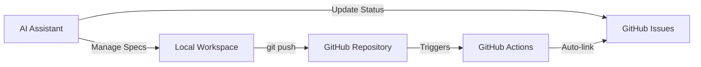

# Design: GitHub Issues Integration

## System Context
The integration bridges the gap between the local-first OpenSpec workflow and the cloud-native GitHub Project management.

## Workflow Integration
Each OpenSpec `Change` SHALL be associated with a GitHub Issue.

1.  **Backlog State**: Items in the backlog exist as GitHub Issues with the `backlog` label.
2.  **Proposal Stage**: When an agent starts a `/openspec-proposal`, they SHALL either link to an existing issue or create a new one. The issue is labeled as `openspec:proposal`.
3.  **Implementation Stage**: Once approved, the issue is labeled `openspec:active`.
4.  **Archival**: When the change is archived, the corresponding GitHub Issue SHALL be closed.

## Labeling Strategy
A standardized set of labels will be created:
- `openspec:proposal`: Currently in the design phase.
- `openspec:active`: Implementation in progress.
- `openspec:archived`: Feature complete and spec updated.
- `backlog`: Verified idea for future implementation.
- `priority:low|medium|high`: Urgency for the roadmap.

## Task Tracking Synchronization
The `tasks.md` remains the authoritative source for technical implementation steps within a specific change. GitHub Issues provide the high-level project management and "Backlog" view.

- **Tasks.md**: Granular, local verification steps.
- **GitHub Issues**: High-level requirements, milestones, and status.
